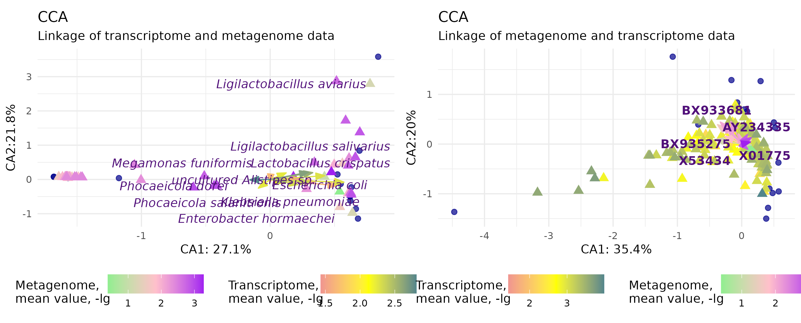
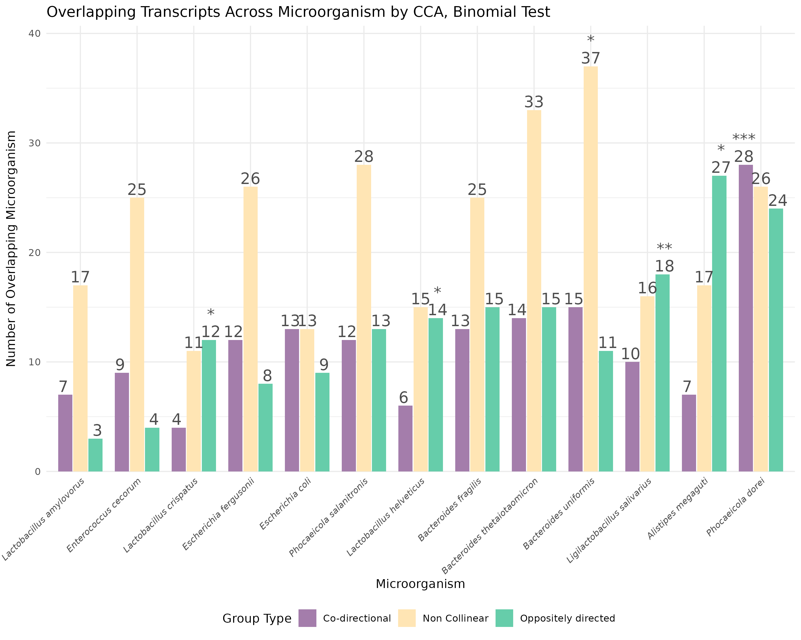
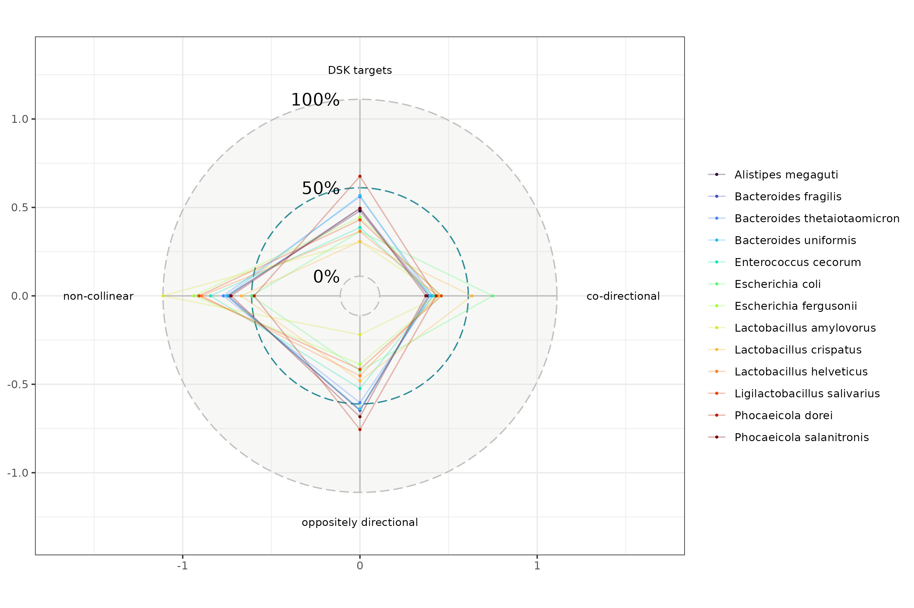

# RNA-mediated interactions: An eRNAi target search algorithm for studying the impact of the metagenome


- The phenomenon of environmental RNA interference (eRNAi) is based on the transfer of small RNA molecules (sRNA) between organisms to suppress the expression of target genes. Investigating the processes of environmental RNA interference provides novel insights into the dynamics of interactions between living beings and raises the question of whether RNA could be transferred between organisms.

## Authors

V. Ishtuganova¹ ², M. Kravchenko¹ ², D.Smutin ³

1. Bioinformatics Institute, Kantemirovskaya st. 2A, 197342, St. Petersburg, Russia
2. Saint-Petersburg State University, Universitetskaya emb. 7/9, 199034, St. Petersburg, Russia
3. Information Technologies, Mechanics and Optics University, Kronverksky Pr. 49, bldg. A, St. Petersburg, Russia


## Aim

- The main goal of the project is the development of an algorithm to identify potential targets in an organism's genome that can be specifically regulated by environmental double-stranded RNAs.

## Contents
- [Pipeline](#Pipeline)
- [Dataset](#Dataset)
- [Methods](#Methods)
- [Installation](#Installation)
- [Usage](#Usage)
- [Testing](#Testing)
- [Results](#Results)
- [Contributing](#Contributing)
- [Literature](#Literature)

## Pipeline

1) Data analysis and selection of suitable target datasets
2) Data pre-processing 
3) Canonical Correspondence Analysis (CCA)
4) Identification of meta-genome and transcriptome overlap regions
5) Statistical validation of results  
4) Pipeline validation and testing 


## Dataset

The data were obtained from public sources.

- *Gallus gallus*, **BioProject PRJNA503784** (Tejas M. Shah et al. 2019)
- *Homo Sapiens*,  **NASA GeneLab - OSD-574** (Park J et al. 2024)

## Methods

The following tools are used in this project: 

### Core Frameworks
- **Snakemake**  
  *Mölder et al., 2021*  

### Metagenomics
- **Kraken 2** | *Lu et al., 2022*  
- **Bracken** | *Lu et al., 2017*  

### Sequence Analysis
- **DSK** | *Rizk et al., 2013*  
- **BLAST+** | *Camacho et al., 2009*  

### Transcriptomics
- **Kallisto** | *Bray et al., 2016*  

### Statistical Computing
- **R** | *R Core Team, 2024*  

## Installation

To get the tool clone the git repository:

```sh
git clnone git@github.com:Valeriisht/eRNAi_project.git
```

Create a conda environment with the necessary packages. 
Activate it:

```sh
conda env create -f environment.yaml
conda activate eRNAi
```

Then you can use your data, such as metagenomic and transcriptomic data.
In order to use your own data, you need to specify the parameters (data references and SRA ID) in the configuration file (```config.yaml```).


## Usage

The scripts for primary data processing can be found in the following folder [```rules```](workflow/rules/) 

To run the process, select the desired rule all in ```SnakeFile``` to process the data.

Example:

```
snakemake --cores 8
```

## Testing

Three types of tests: unit tests, integration tests, and generation tests cover the project.

Nowdays: 

```
[Test Coverage]
│
├── Unit Tests:        ✔ Almost implemented (and some in progress)
│   └── Coverage:      
│
├── Integration Tests:  ⌛ In progress
└── Generative Tests: ⏳ Planned
```

To run it, execute the command:

```
pytest tests/ 
```

## Results

1) Canonical Correspondence Analysis (CCA)

   - The relationship between microorganisms and the transcriptome

   vis: [image](img/CCA_graphics.png)

   

Instructions can be found in [script_CCA](CCA_analysis/CCA.R)
   
2) DSK+BLAST revealed a significant number of common sites between microbial sequences and the host genome

params:

- e-value: 0.1
- word_size 12 
- task blastn-short

3) Statistics

**Check whether the probability of finding intersections is statistically significant and associated with CCA.**

- Fisher tests:

  - Probabilities for DSK-targets inside and outside the transcriptome in CCA - intersection with CCA transcripts

  vis: [image](img/statistic_tests/CCA_out(graphic1).png)

  .png)

  - Probabilities for DSK-targets with co-directional, oppositely directed and other transcripts within CCA transcripts

  vis: [image](img/statistic_tests/fisher_cca.png)

  

- Binomial test:

  - Probability co-directional/opposite-directional/otherwise

  vis: [image](img/statistic_tests/binomial_cca.png)
  
  

- T-test

  - Differences in probabilities of direction by group between species - revealed no statistically significant difference

  vis of transcript overlapping between different organisms: [image](img/statistic_tests/windrose.png)
  
  


Instructions can be found in [script_CCA](CCA_analysis/Statistic_Analysis.R)

**Output:**

- The assay results do not contradict  hypothesis concerning that non-coding regions of prokaryotic mRNAs may act as regulatory elements, exerting influence on the expression of target genes in eukaryotic cells.
- The developed algorithm - is potentially able to detect the effectors of inter-organismal eRNAi interactions.

 
## Contributing 

[Contributing.md](docs/CONTRIBUTING.md).

## Literature
1) Park, J., Overbey, E. G., Narayanan, S. A., Kim, J., Tierney, B. T., Damle, N., Najjar, D., Ryon, K. A., Proszynski, J., Kleinman, A., Hirschberg, J. W., MacKay, M., Afshin, E. E., Granstein, R., Gurvitch, J., Hudson, B. M., Rininger, A., Mullane, S., Church, S. E., … Mason, C. E. (2024). Spatial multi-omics of human skin reveals KRAS and inflammatory responses to spaceflight. Nature Communications, 15(1), 4773. https://doi.org/10.1038/s41467-024-48625-2

2) Shah, T. M., Patel, J. G., Gohil, T. P., Blake, D. P., & Joshi, C. G. (2019). Host transcriptome and microbiome interaction modulates physiology of full-sibs broilers with divergent feed conversion ratio. Npj Biofilms and Microbiomes, 5(1), 24. https://doi.org/10.1038/s41522-019-0096-3

3) Mölder, F., Jablonski, K. P., Letcher, B., Hall, M. B., Tomkins-Tinch, C. H., Sochat, V., Forster, J., Lee, S., Twardziok, S. O., Kanitz, A., Wilm, A., Holtgrewe, M., Rahmann, S., Nahnsen, S., & Köster, J. (2021). Sustainable data analysis with Snakemake. F1000Research, 10, 33. https://doi.org/10.12688/f1000research.29032.1

4) Lu, J., Rincon, N., Wood, D. E., Breitwieser, F. P., Pockrandt, C., Langmead, B., Salzberg, S. L., & Steinegger, M. (2022). Metagenome analysis using the Kraken software suite. Nature Protocols, 17(12), 2815–2839. https://doi.org/10.1038/s41596-022-00738-y

5) Lu, J., Breitwieser, F. P., Thielen, P., & Salzberg, S. L. (2017). Bracken: estimating species abundance in metagenomics data. PeerJ Computer Science, 3, e104. https://doi.org/10.7717/peerj-cs.104

6) Bray, N. L., Pimentel, H., Melsted, P., & Pachter, L. (2016). Near-optimal probabilistic RNA-seq quantification. Nature Biotechnology, 34(5), 525–527. https://doi.org/10.1038/nbt.3519

7) Rizk, G., Lavenier, D., & Chikhi, R. (2013). DSK: k -mer counting with very low memory usage. Bioinformatics, 29(5), 652–653. https://doi.org/10.1093/bioinformatics/btt020

8) Camacho, C., Coulouris, G., Avagyan, V., Ma, N., Papadopoulos, J., Bealer, K., & Madden, T. L. (2009). BLAST+: architecture and applications. BMC Bioinformatics, 10(1), 421. https://doi.org/10.1186/1471-2105-10-421
   
 9) R Core Team (2024). _R: A Language and Environment for Statistical Computing_. R Foundation for Statistical Computing, Vienna, Austria. <https://www.R-project.org/>.


